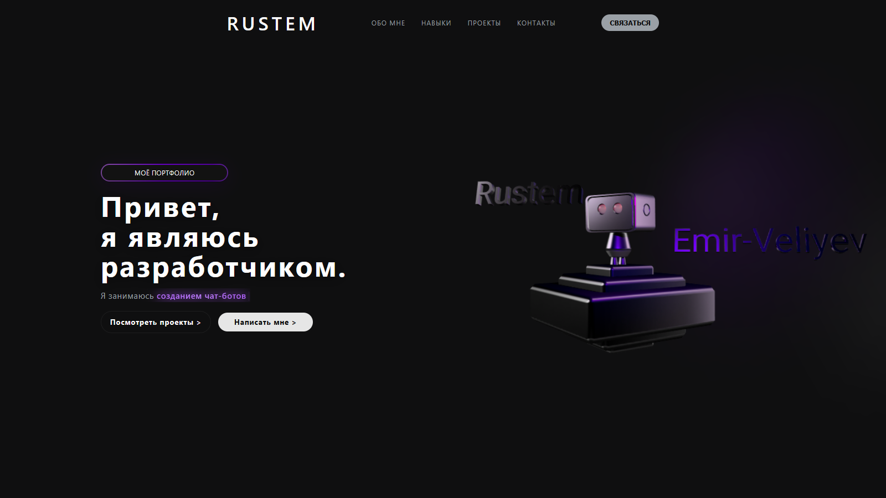

# 🌐 Портфолио с 3Д Роботом



## 📌 О проекте
Это персональный статичный сайт‑портфолио. Сейчас он в виде шаблона, но его можно развивать и настраивать под себя в будущем.  
Сайт сделан на **HTML, CSS и JavaScript**, используется немного анимаций и 3D‑модель для живости.

На сайте есть разделы:
- 🧑‍💻 Обо мне  
- 🛠 Навыки  
- 📂 Проекты  
- ✉ Контакты  

## ⚙️ Технологии
- **HTML5 / CSS3 / JavaScript**
- [AOS](https://michalsnik.github.io/aos/) — анимации при скролле  
- [Typed.js](https://mattboldt.github.io/typed.js/) — эффект печатающегося текста  
- [Spline](https://spline.design/) — 3D‑модель на странице  

## 🚀 Как запустить у себя
1. Склонировать репозиторий:
   ```bash
   git clone https://github.com/MeruzonTeam/portfolio-template-with-3d.git
   ```
2. Перейти в папку проекта:
   ```bash
   cd portfolio-template-with-3d
   ```
3. Открыть файл `index.html` в браузере.

## 📂 Структура проекта
```
portfolio-template-with-3d/
│── index.html        # Главная страница
│── static/           # Стили и скрипты
│   ├── css/
│   └── scripts/
│── src/
│   ├── web/          # Изображения для сайта
│   └── github/       # Превью

## 📜 Лицензия
Проект распространяется под лицензией **MIT**.  

По‑человечески:  
- ✅ Можно свободно использовать, менять и публиковать (в том числе для коммерческих проектов).  
- ✅ Можно делиться и дорабатывать под себя.  
- ❌ Нельзя выдавать оригинальный шаблон за свою работу.  
- ❌ Гарантий нет — используете «как есть».  

---

2025-09-21 & Rustem Emir-Veliyev | Все права защищены
